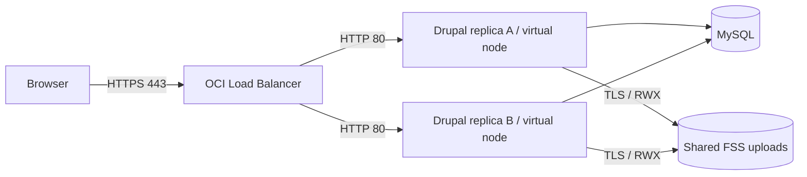

# Drupal on OKE virtual nodes with shared FSS storage

Build a two-replica Drupal research website on Oracle Kubernetes Engine (OKE)
virtual nodes. MySQL stores content and sessions; OCI File Storage Service (FSS)
stores uploads on an encrypted ReadWriteMany volume. No worker VMs are managed by
the demo operator. OKE, the load balancer, MySQL, and FSS still incur charges.

The included Nexus Research module creates a homepage, research projects,
researchers, events, and image/document upload fields. This is a disposable demo,
not a production hardening baseline.

## Architecture



The application code lives in the image. Only
`/var/www/html/sites/default/files` is mounted from FSS.
Cookie persistence keeps a browser on one healthy backend; shared MySQL sessions
and FSS files allow another replica to serve the same user when needed.
There is no HPA: the chart runs two fixed replicas, each requesting and limiting
1 CPU and 4 GiB.

## What is included

- `charts/serverless-drupal`: Helm chart, external Secret references, HTTPS LB,
  encrypted FSS StorageClass/PVC, and an idempotent setup Job.
- `image`: Drupal 11.4.7, a pinned Composer lockfile, theme, and demo module.
- `scripts`: private credential setup, self-signed TLS setup, chart tests, and a
  publication guard.
- `examples`: placeholders only. No account identifiers or working credentials.

All environment configuration belongs in ignored `.local/`. Never commit real
resource identifiers, kubeconfig files, certificates, passwords, rendered
manifests, or credential-bearing command output.

## 1. Prepare your prerequisites

You need:

1. An active **enhanced OKE cluster with a ready virtual-node pool**, VCN-native
   pod networking, and working CoreDNS. The walkthrough targets ARM64. For x86,
   build `linux/amd64` and set `nodeSelector.kubernetes.io/arch: amd64`.
2. An active **MySQL DB System**, reachable privately from the pod subnet.
   Have its administrator username/password available locally for first setup.
3. A dedicated FSS subnet, FSS NSG, pod NSG, and LB frontend/backend NSGs.
4. OCI CLI authentication, Kubernetes access, Helm 3, Python 3, OpenSSL, Docker
   with Buildx, and permission to push to **your own** container registry.
5. Sufficient capacity for two replicas plus one rolling-update replica or setup
   Job. The setup Job also requests 1 CPU / 4 GiB. No metrics-server is needed.

Clone the repository and prepare a private workspace:

```sh
git clone https://github.com/alcampag/oke-vn-drupal.git
cd oke-vn-drupal
mkdir -p .local
chmod 700 .local
export OCI_REGION='<your-region>'
export CLUSTER_ID='<your-cluster-identifier>'
export COMPARTMENT_ID='<your-compartment-identifier>'
export FSS_SUBNET_ID='<your-fss-subnet-identifier>'
export FSS_NSG_ID='<your-fss-nsg-identifier>'
export AVAILABILITY_DOMAIN='<your-availability-domain-name>'
```

Replace placeholders locally. Do not paste the resulting values into a commit,
issue, screenshot, or pull request.

```sh
oci ce cluster create-kubeconfig --cluster-id "$CLUSTER_ID" \
  --region "$OCI_REGION" --file "$PWD/.local/kubeconfig" \
  --token-version 2.0.0 --kube-endpoint PUBLIC_ENDPOINT
export KUBECONFIG="$PWD/.local/kubeconfig"
chmod 600 "$KUBECONFIG"
kubectl get nodes -o wide
kubectl get pods -n kube-system
kubectl create namespace drupal-demo
```

For a private Kubernetes endpoint, use `PRIVATE_ENDPOINT` and establish the
appropriate private-network access first.

## 2. Configure IAM and network access

Follow [the infrastructure prerequisites](docs/infrastructure.md) before
installing the chart. In particular:

- Grant the cluster permission to manage FSS resources and use the required
  networking resources.
- Permit the LB to reach pod TCP 80 and health-check `/healthz.html`.
- Permit pods to reach MySQL TCP 3306 and FSS TLS TCP 2051.
- Permit public frontend TCP 443. The Service exposes no port 80.
- Provide DNS and the outbound access required for image pulls.

The chart attaches **your supplied LB frontend and backend NSGs** and sets
`oci.oraclecloud.com/security-rule-management-mode: None`. It does not add,
remove, or manage their rules.

Create a mount target in the FSS subnet with the FSS NSG attached. The chart
will create a new filesystem through dynamic provisioning:

```sh
oci fs mount-target create \
  --region "$OCI_REGION" \
  --availability-domain "$AVAILABILITY_DOMAIN" \
  --compartment-id "$COMPARTMENT_ID" \
  --subnet-id "$FSS_SUBNET_ID" \
  --nsg-ids "[\"$FSS_NSG_ID\"]" \
  --display-name drupal-demo-mt \
  --wait-for-state ACTIVE
```

Record the returned mount-target identifier **only in your local values file**.
If a suitable mount target already exists, reuse it.

## 3. Build your image

Choose a repository in your own registry and authenticate using its supported
login flow. For OCIR, use an auth token through `docker login --password-stdin`;
do not put tokens directly in command arguments.

```sh
export IMAGE_REPOSITORY='<registry-host>/<registry-namespace>/serverless-drupal'
export IMAGE_TAG='11.4.7-demo.1'
docker buildx build --platform linux/arm64 \
  --tag "$IMAGE_REPOSITORY:$IMAGE_TAG" --push ./image
```

The Dockerfile preserves the official Drupal entrypoint and Apache command.
Composer installs **Drupal 11.4.7** from the committed lockfile and audits its
dependencies. The pinned PHP 8.4 base originally shipped Drupal 11.4.5; the
Composer install replaces that application version. See
[image maintenance](docs/operations.md#image-updates) for upgrade instructions.

For a private registry, create a registry pull Secret in `drupal-demo` using
your approved secret-management process and add its name to
`imagePullSecrets` in local values. The setup Job uses it too.

## 4. Create database and administrator Secrets

The helper prompts for sensitive input without echoing it, generates an
application password and Drupal administrator password when needed, and saves
them in `.local/credentials.json` with mode 0600. It creates Kubernetes Secrets
directly; **their contents never enter Helm values**.

```sh
python3 scripts/configure.py --namespace drupal-demo \
  --database-host '<private-mysql-address>' --initialize-mysql
```

On the first deployment, the setup Job uses the MySQL administrator Secret to
create the application database/user and grant access only to that database.
Existing users are not given a new password; supply the existing application
password if reusing one.

If your DBA has already created the database/user, omit
`--initialize-mysql`, enter that user's password, and leave
`bootstrap.mysqlAdminSecret: ""` in local values.

To reapply the same Secrets after an interrupted setup:

```sh
python3 scripts/configure.py --namespace drupal-demo --apply-existing
```

Do not generate new credentials over an existing site. The helper refuses to
overwrite its saved file. The MySQL administrator credentials are never passed
to the Drupal web pods.

## 5. Prepare private Helm values

```sh
cp examples/values.example.yaml .local/values.yaml
chmod 600 .local/values.yaml
```

Edit `.local/values.yaml` with your registry, availability domain, compartment,
mount target, LB NSGs, and LB subnet CIDR. The proxy CIDR must cover only the
trusted load balancer subnet so Drupal can generate HTTPS redirects and Secure
session cookies.

For public DNS, set `drupal.trustedHostPatterns` to your intended hostname
pattern. The default wildcard is a convenience for this disposable IP-based demo.

Do not store passwords in this file. Use the Secret names from step 4.

## 6. Create a temporary TLS certificate

The LB needs a TLS Secret before it can allocate its public IP:

```sh
python3 scripts/tls.py --namespace drupal-demo --hostname drupal.invalid
```

This temporary certificate will be replaced with an IP-matching certificate
after the LB is created. Both certificates are self-signed and trigger browser
trust warnings. For a real deployment, supply a trusted certificate instead.

## 7. Deploy Drupal and create the demo

```sh
helm lint charts/serverless-drupal -f .local/values.yaml
helm upgrade --install serverless-drupal charts/serverless-drupal \
  --namespace drupal-demo -f .local/values.yaml \
  --wait --timeout 15m
```

The chart provisions the shared RWX filesystem, starts two pods, and then runs
the setup Job. On an empty database, the Job installs Drupal; on an installed
site, it enables the module if needed and runs database updates/cache rebuilds.
It **refuses to reinstall over a nonempty database that cannot bootstrap**.

The setup Job writes a small `demo-storage-check.txt` file on FSS.
Helm deletes successful setup Jobs; failed Jobs remain available for inspection.

```sh
kubectl get pods,pvc,svc -n drupal-demo
kubectl rollout status deployment/serverless-drupal -n drupal-demo
```

Expect two ready replicas, a bound RWX PVC, and an external LB IP. Initial
provisioning can take several minutes.

## 8. Set the final certificate and remove bootstrap access

Get the assigned IP and issue its certificate:

```sh
export LB_IP="$(kubectl get svc serverless-drupal -n drupal-demo \
  -o jsonpath='{.status.loadBalancer.ingress[0].ip}')"
python3 scripts/tls.py --namespace drupal-demo --ip "$LB_IP"
```

In `.local/values.yaml`, set `service.tls.revision: "1"` to trigger LB
reconciliation, and set `bootstrap.mysqlAdminSecret: ""`.
Upgrade using the same command from step 7. Then remove the temporary elevated
Secret:

```sh
kubectl delete secret drupal-mysql-admin -n drupal-demo --ignore-not-found
```

Remove its entry from the local credentials file too if you no longer need it;
do not use `--apply-existing` afterwards unless you intend to recreate it.
The regular application and Drupal administrator Secrets remain necessary.

## 9. Open and demonstrate the website

Open `https://<LB_IP>/` and accept the self-signed certificate warning.
Log in at `/user/login`; read the generated Drupal username/password locally
from the `drupal-site-admin` section of `.local/credentials.json`.
Do not use your MySQL administrator login.

A useful five-minute demo:

1. Show the research homepage and the two virtual-node pods.
2. Open `/node/add/project`; add a project image and a PDF/text document.
   `/admin/content/files` lists uploads but is not an upload form.
3. Show the resulting public URLs under
   `/sites/default/files/project-images/` and
   `/sites/default/files/project-documents/`.
4. Show the PVC/PV and its encrypted RWX configuration.
5. Replace the pods with `kubectl rollout restart deployment/serverless-drupal
   -n drupal-demo`, wait for rollout, and reload the uploaded file and login.
   The FSS data and MySQL content survive pod replacement.

The theme's hero image is packaged in the image; **it is not an FSS upload**.
Upload that image from `image/web/themes/custom/nexus_theme/images/` if you want
an immediately available demo asset.

```sh
curl --insecure --fail "https://$LB_IP/healthz.html"
curl --insecure --fail "https://$LB_IP/sites/default/files/demo-storage-check.txt"
kubectl get pvc serverless-drupal-files -n drupal-demo
kubectl get pv
```

`--insecure` is used only because this walkthrough intentionally creates a
self-signed certificate. Read [operations and troubleshooting](docs/operations.md)
for application checks, safe updates, and cleanup.

## Validation and publication

```sh
helm lint charts/serverless-drupal -f examples/values.ci.yaml
python3 -m venv .local/venv
.local/venv/bin/pip install PyYAML==6.0.2
.local/venv/bin/python scripts/test-chart.py
git add README.md charts image scripts docs examples .github .gitignore LICENSE
python3 scripts/check-public.py
```

The publication guard checks the staged/tracked content. Also run a reputable
secret scanner such as Gitleaks before pushing. Never use `git add -f .local`.
Review staged files and commit history; ignoring a file does not remove it from
older commits.

## Scope and licensing

This chart does not create the OKE cluster, MySQL DB System, VCN, IAM policies,
NSGs, or mount target. Those are explicit prerequisites. It creates the FSS
filesystem/PV dynamically and retains it on PVC deletion.

The source is distributed under GPL-2.0-or-later; upstream dependencies retain
their respective licenses. The research people/projects are fictional demo
content. The included hero illustration was generated for this demo.
